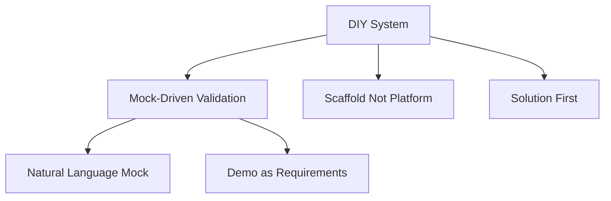

# 可视化需求分析

> Obsidian 的核心启示：没有图谱可视化，信息密度极低

---

## 问题诊断

### 当前状态

```
34 个概念卡片
+ 19 个连接关系
+ 24 个对话记录
= 77 个文件分散在目录中

没有可视化时：
- 概念是孤立的点
- 连接是隐式的
- 知识结构不可见
- 难以发现模式和关联
```

### 信息密度问题

| 形式 | 信息密度 | 理解效率 |
|------|---------|---------|
| 纯文本列表 | 低 | 需逐个点开阅读 |
| 层级目录 | 中 | 有分类但无关联 |
| **图谱可视化** | **高** | **一眼看见关联网络** |

---

## Obsidian 的启示

### Obsidian 核心能力

1. **Graph View（图谱视图）**
   - 节点 = 笔记/概念
   - 边 = 链接关系
   - 颜色 = 标签/类别
   - 聚类 = 知识群组

2. **Backlinks（反向链接）**
   - 自动发现引用关系
   - 显示知识的双向连接

3. **Local Graph（局部图谱）**
   - 聚焦当前概念的关联
   - 上下文清晰可见

### 为什么这很重要

```
场景：理解 "Mock-Driven Validation"

纯文本方式：
- 打开 mock-driven-validation.md
- 看到 "Related Concepts" 列表
- 需要逐个打开相关概念
- 无法直观看到关联强度

可视化方式：
- Mock-Driven Validation 是中心节点
- 周围环绕相关概念（NL-Mock, Demo-as-Requirements...）
- 连线粗细表示关联强度
- 一眼看出概念群组
- 可能发现意料之外的连接
```

---

## DIY 系统的可视化方案

### 方案 1：Obsidian 兼容（推荐）

**实现**：
- 文件已经是 Markdown
- 使用 Obsidian 打开整个目录
- 自动识别 [[wikilink]] 语法
- 自动生成图谱

**优点**：
- 零开发成本
- 功能成熟
- 用户熟悉
- 双向链接自动发现

**缺点**：
- 需要安装 Obsidian
- 非 Web 化

### 方案 2：Web 图谱可视化

**技术栈**：
- D3.js / Cytoscape.js / vis-network
- 解析 Markdown 中的链接
- 生成力导向图

**功能**：
- 节点：概念/对话/连接
- 边：引用关系
- 交互：点击查看详情
- 过滤：按类别显示

**数据格式**：
```json
{
  "nodes": [
    {"id": "mock-driven-validation", "group": "concept", "size": 30},
    {"id": "natural-language-mock", "group": "concept", "size": 20},
    ...
  ],
  "links": [
    {"source": "mock-driven-validation", "target": "natural-language-mock", "value": 3},
    ...
  ]
}
```

**优点**：
- 浏览器访问
- 可定制样式
- 可集成到 Web Demo

**缺点**：
- 需要开发
- 需要维护

### 方案 3：文本图形化

**简单实现**：
```
使用 Mermaid / PlantUML 在 Markdown 中嵌入图表

例：概念关系图


```

**优点**：
- 纯文本，版本可控
- 无需额外工具
- GitHub 原生支持

**缺点**：
- 静态，无交互
- 需要手动维护

---

## 推荐实现路径

### 短期（立即）

**使用 Obsidian**：
1. 下载 Obsidian
2. 打开 zettel/ 目录为 Vault
3. 自动识别所有 Markdown 文件
4. 打开 Graph View 查看关系图谱

**价值**：
- 立即获得可视化能力
- 零开发成本
- 验证可视化价值

### 中期（可选）

**Web 可视化工具**：
1. 开发简单的图谱页面
2. 解析所有 Markdown 的 frontmatter 和链接
3. 生成力导向图
4. 部署到 GitHub Pages

**使用场景**：
- 对外分享知识库结构
- 不安装 Obsidian 的用户
- 集成到 DIY 系统的 Web Demo

### 长期（未来）

**AI 辅助可视化**：
- 自动发现隐式关联
- 智能聚类相似概念
- 推荐未发现的连接
- 生成知识地图

---

## 可视化对 DIY 系统的重要性

### 知识创造阶段

```
可视化帮助：
- 发现概念间的关联
- 识别知识结构缺陷
- 发现重复或矛盾
- 激发新的连接想法
```

### 知识使用阶段

```
可视化帮助：
- 快速理解知识体系
- 定位相关概念
- 发现学习路径
- 理解概念演进
```

### DIY 系统应用

```
用户查看 diy-system-overview.md
    ↓
发现相关概念图谱
    ↓
点击感兴趣的概念深入
    ↓
查看该概念的关联网络
    ↓
全面理解知识体系
```

---

## 具体行动建议

### 立即行动（今天）

1. **安装 Obsidian**
   ```
   下载: https://obsidian.md/
   打开: zettel/ 目录
   结果: 立即看到知识图谱
   ```

2. **验证可视化价值**
   - 查看 Graph View
   - 观察概念聚类
   - 发现连接模式
   - 评估是否需要 Web 版本

### 本周行动

1. **规范链接格式**
   - 确保所有概念使用 [[wikilink]]
   - 统一 frontmatter 格式
   - 添加标签分类

2. **优化图谱结构**
   - 根据可视化调整目录
   - 补充缺失的连接
   - 合并过于分散的概念

### 可选开发

1. **Web 可视化**
   - 如果 Obsidian 满足需求 → 不开发
   - 如果需要 Web 分享 → 开发简易版本

---

## 结论

> **没有可视化的知识库，就像没有地图的城市——你可以住在里面，但永远无法理解它的结构。**

可视化不是锦上添花，是知识管理的核心能力。

Obsidian 证明了这一点，我们应该：
1. **立即使用 Obsidian** 查看现有知识图谱
2. **评估可视化效果** 决定是否需要 Web 版本
3. **持续优化连接** 让知识结构更清晰

---

*补充记录：2026-03-08*
*触发：回顾 Obsidian 的可视化能力*
